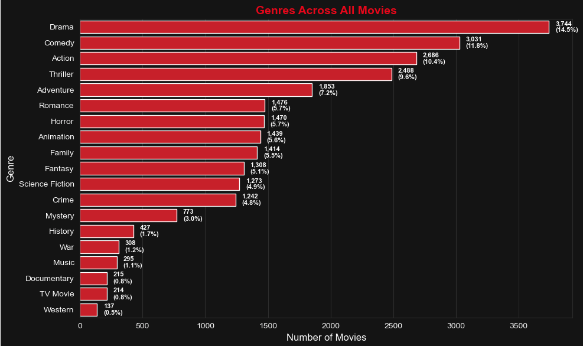
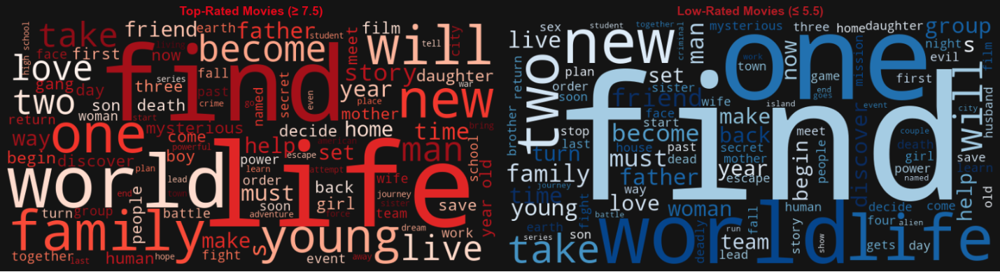

# 🎬 Netflix Data-Driven Analysis
A comprehensive data exploration project analyzing 10,000+ Netflix-style movies using metadata to uncover what makes a movie successful — from genres and languages to popularity, ratings, and narrative themes.

---

## 📌 Project Overview

This project explores a rich dataset of movie metadata to understand key patterns and drivers of success in the entertainment domain. It focuses on release trends, genre performance, language diversity, viewer ratings, popularity metrics, and narrative themes using both exploratory data analysis and clustering.

---

## 🧠 Key Questions Explored

- What genres are most common and which ones are associated with high ratings?
- How has movie production evolved over the years?
- Which languages dominate Netflix-style content?
- What is the relationship between popularity, vote count, and viewer ratings?
- What narrative themes appear frequently in high-performing movies?
- Can we group movies into meaningful clusters based on viewer response?

---

## 📊 Highlights & Insights

- 📅 Movie production surged post-2000, peaking around 2017.
- 🌍 English dominates, but Hindi and French appear as notable languages.
- 🎭 Top genres: Drama, Comedy, and Thriller dominate in count.
- ⭐ Ratings are skewed toward 5–7.5, while vote count correlates more with popularity than quality.
- 🔁 Documentary and History genres tend to have higher average ratings.
- 🔡 Common themes: *love*, *family*, *revenge*, *heroism*, and *survival*.
- 📈 KMeans clustering uncovered 4 distinct movie groups based on vote count, rating, and popularity.

---

## 📷 Screenshots

---

## 💼 Business Recommendations

- **Leverage rising genres** like Sci-Fi and Animation to target younger, trend-focused viewers.
- **Invest in high-impact themes** such as family, true story, and revenge to boost emotional engagement.
- **Develop a hybrid success metric** combining rating, vote count, and popularity for smarter acquisition.
- **Promote hidden gems** — movies with high ratings but low visibility — via editorial curation.

---

## 🚀 Future Improvements

- Build a simple content-based recommendation engine.
- Deploy as an interactive app using Streamlit or Flask.
- Modularize code into functions for better readability and reuse.

---

## 🧰 Technologies Used

- **Python**
- **Pandas, NumPy**
- **Matplotlib, Seaborn**
- **Scikit-learn (KMeans)**
- **Jupyter Notebook**

---

## 👨‍💻 Author

**Harsh Bajpai**
 
Master's in Statistical Data Science  
[LinkedIn](https://www.linkedin.com/in/harsh-bajpai22)

---

## ⭐️ If you liked this project…

Feel free to ⭐ the repo, fork it, or suggest improvements.  
Open to collaboration and feedback!
